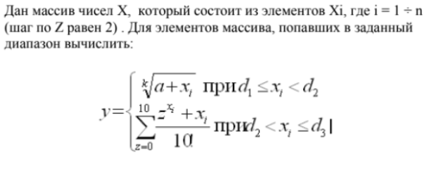
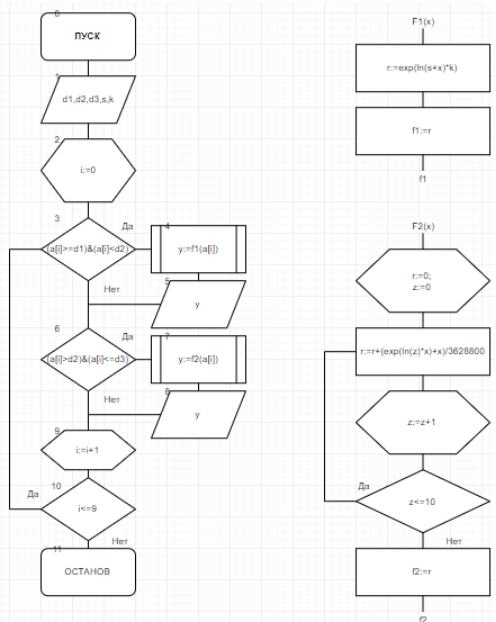
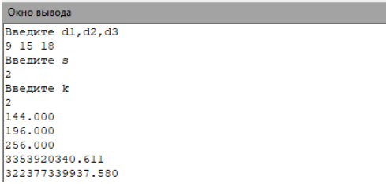
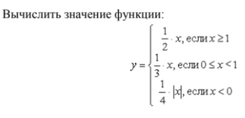
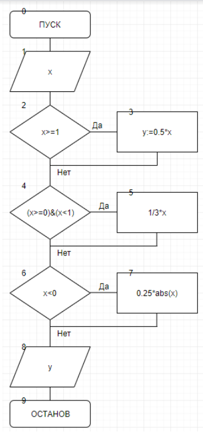
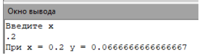
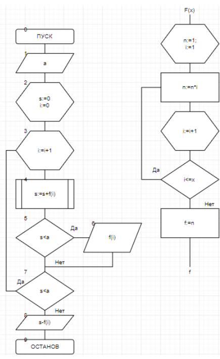
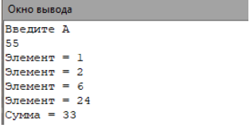

.. title: Лабораторная работа №11 "Комбинированные вычислительные процессы"
.. slug: lab-11
.. date: 2019-12-19
.. tags: computer-science, lab, 1st-grade
.. author: Eugene Savostin
.. link: https://docs.google.com/document/d/1REGdTI0bzRC_wK4sleiIlHwBTD4xuzKfyoWzki6nzv4/edit?usp=sharing
.. description: 
.. category: lab-work

:Тема: Комбинированные вычислительные процессы
:Цель: Освоить организацию комбинированных вычислительных процессов при выполнении задач
:Используемое оборудование: ПК, среда программирования PascalABC

=========
Задание 1
=========
**Постановка задачи:** 

:Блок-схема: 

:Код программы:

.. listing:: 11.1.pas pascal

:Результат работы:

**Анализ полученных результатов:** 

В ходе выполнения работы я задействовал функции, циклы и операторы “if..then” для выполнения поставленной задачи.

=========
Задание 2
=========
**Постановка задачи:** 

:Блок-схема: 

:Код программы:

.. listing:: 11.2.pas pascal

:Результат работы:

**Анализ полученных результатов:** 

В ходе выполнения работы я использовал циклы и операторы “if..then”, чтобы программа выводила верное значение y.

=========
Задание 3
=========
**Постановка задачи:** 

Составить программу подсчета суммы факториалов целых чисел, где сумма не превышает число А, которое вводится с клавиатуры.
На экран вывести суммы и все слагаемые.

:Блок-схема: 

:Код программы:

.. listing:: 11.3.pas pascal

:Результат работы:

**Анализ полученных результатов:** 

В ходе выполнения работы я использовал различные виды циклов “for .. to.. do” и “while”, чтобы выполнить поставленную задачу.

**Вывод:**

В ходе выполнения лабораторной работы мной были использованы различные циклы и операторы условия. 
Иными словами, я организовывал вычисления с помощью комбинированных вычислительных процессов.