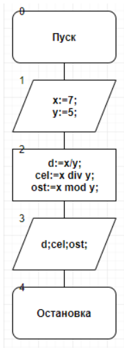

.. title: Лабораторная работа №1 “Линейные вычислительные процессы”
.. slug: lab-1
.. date: 2019-10-10
.. tags: computer-science, lab, 1st-grade
.. author: Eugene Savostin
.. link: https://docs.google.com/document/d/1qtumwI2Nwd2BJgLSHOVxSi0G_VbmRmFjJiZcwt5IqbA/edit
.. description: 
.. category: lab-work

:Тема: Линейные вычислительные процессы
:Цель: Реализовать линейный вычислительный процесс средствами PascalABC
:Используемое оборудование: ПК, среда программирования PascalABC

=========
Задание 1
=========
**Постановка задачи:** 

Даны числа 7 и 5. Определить результат вещественного деления, целочисленного деления и найти остаток от целочисленного деления.

:Блок-схема: 

:Код программы:

.. listing:: 1.1.pas pascal

:Результат работы:

.. image:: ../../images/1.1_res.png

**Анализ полученных результатов:** 

Выполняя задание применил такие операции, как / - вещественное деление, div - целочисленное деление и mod - нахождение остатка от целочисленного деления.

=========
Задание 2
=========
**Постановка задачи:** 

.. image:: ../../images/1.2_q.png

:Блок-схема: 

.. image:: ../../images/1.2.png 

:Код программы:

.. listing:: 1.2.pas pascal

:Результат работы:

.. image:: ../../images/1.2_res.png

**Анализ полученных результатов:**  

Выполняя данную работу, я упрощал большое выражение, превратив значение синуса в просто число заранее, 
чтобы ускорить процесс расчета. Также, для удобства при использовании, сократил количество знаков после запятой до двух.

=========
Задание 3
=========
**Постановка задачи:**

.. image:: ../../images/1.3_q.png

:Блок-схема:

:Код программы:

.. listing:: 1.3.pas pascal

:Результат работы:

.. image:: ../../images/1.3_res.png

**Анализ полученных результатов:** 

Выполняя данное задание, я разложил большое выражение на несколько более мелких и простых, 
дабы упростить и ускорить процесс расчета, а также узнал, как в среде PascalABC возводить в степень, 
которая состоит из переменных. Для удобства при использовании сократил число знаков после запятой в ответе до двух.

=========
Задание 4
=========
**Постановка задачи:**

С клавиатуры вводится трехзначное число. Вычислить сумму его цифр.

:Блок-схема: 

.. image:: ../../images/1.4.png 

:Код программы:

.. listing:: 1.4.pas pascal

:Результат работы:

**Анализ полученных результатов:**

Выполняя данное задание, применил такие действия над значениями, как div - целочисленное деление и
 mod - нахождение остатка от целочисленного деления, и комбинировал их.

=========
Задание 5
=========
**Постановка задачи:**

Ввести трехзначное число а. Поменять крайние цифры числа местами.

:Блок-схема: 

:Код программы:

.. listing:: 1.5.pas pascal

:Результат работы:

.. image:: ../../images/1.5_res.png

**Анализ полученных результатов:**

Выполняя данное задание, применил такие действия над значениями, как div - целочисленное деление 
и mod - нахождение остатка от деления, а затем из полученных результатов скомбинировал новое число, как гласило задание.

=========
Задание 6
=========
**Постановка задачи:**

Выяснить, на каком этаже, в каком подъезде 9-этажного дома живет друг, если известен номер его квартиры, а так;е, 
что на каждом этаже располагается 4 квартиры. Номер интересующей нас квартиры вводится с клавиатуры. Вывести 
номер подъезда и номер этажа, на котором живет друг.

:Блок-схема: 

.. image:: ../../images/1.6.png 

:Код программы:

.. listing:: 1.6.pas pascal

:Результат работы:

**Анализ полученных результатов:**

В ходе выполнения работы был создан алгоритм, который способен по номеру квартиры
вычислить ее точное местоположение. А именно: номер подъезда и номер этажа.

**Вывод:**

В ходе выполнения лабораторной работы я научился работать с линейными вычислительными процессами при помощи 
различных действий над данными, а именно: сложения, вычитания, целочисленного деления, умножения, вещественного 
деления, вычисления остатка от деления и возведения в степень. Для ускорения работы программы я разбивал 
большие модули выражений на более простые и емкие.