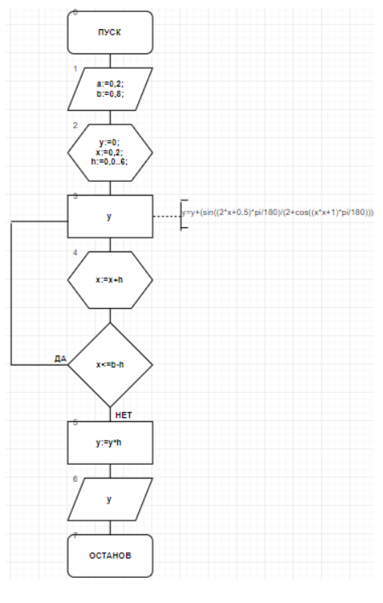
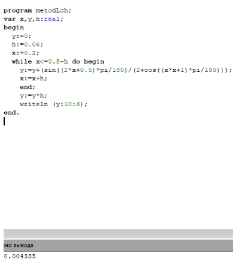
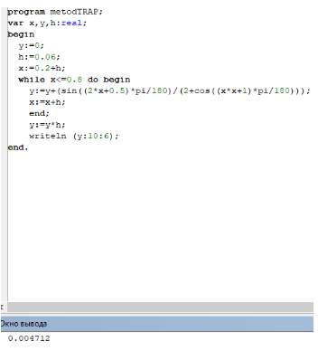
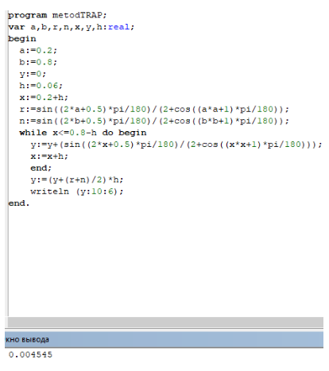

.. title: Лабораторная работа №3 "ДЦВП с управлением по аргументу. Численное интегрирование". Вариант - 9
.. slug: lab-3
.. date: 2019-10-30
.. tags: computer-science, lab, 1st-grade
.. author: Eugene Savostin
.. link: https://docs.google.com/document/d/1RPFtA0Rkep5uIQ7Ueqc0M0lzt5s-ZebKUq8osBmI8NI/edit?usp=sharing
.. description: 
.. category: lab-work

:Тема: Детерминированный циклический вычислительный процесс с управлением по аргументу. Численное интегрирование
:Цель: Научиться организации ДЦВП с управлением по аргументу на примере численного интегрирования
:Используемое оборудование: ПК, среда программирования PascalABC

=========
Задание 1
=========
**Постановка задачи:** 

Решить выражение методом левых частей.

:Блок-схема: 

:Код программы:

.. listing:: 3.1.pas pascal

:Результат работы:

**Анализ полученных результатов:** 

Выполняя работу, я использовал для вычислений оператор “while”. При введении пропорциональных значений 
величины шага (0,06;0.006 и т.д.) получались примерно одинаковые, но не идентичные, результаты. Так 
получалось из-за погрешности, существующей в самой математической формуле.

=========
Задание 2
=========
**Постановка задачи:** 

Решить выражение методом правых частей.

:Блок-схема: 

.. image:: ../../images/3.2.png 

:Код программы:

.. listing:: 3.2.pas pascal

:Результат работы:

**Анализ полученных результатов:** 

Выполняя работу, я использовал для вычислений оператор “while”. При введении пропорциональных значений величины шага 
(0,06;0.006 и т.д.) получались примерно одинаковые, но не идентичные, результаты. Так получалось из-за погрешности, 
существующей в самой математической формуле. Различие с предыдущей задачей состоит в том, что нижний предел в интеграле 
там был равен 0,2, а верхний - 0,8-h. Здесь же, наоборот, нижний - 0,2+h, а верхний - 0.8.

=========
Задание 3
=========
**Постановка задачи:** 

Решить выражение с помощью метода трапеций

:Блок-схема: 

.. image:: ../../images/3.3.png 

:Код программы:

.. listing:: 3.3.pas pascal

:Результат работы:

**Анализ полученных результатов:** 

Выполняя данную задачу, я вводил дополнительные идентификаторы для значений функции в точках. 
При введении пропорциональных значений величины шага (0,06;0.006 и т.д.) получались примерно одинаковые, 
но не идентичные, результаты. Так получалось из-за погрешности, существующей в самой математической формуле.

=========
Задание 4
=========
**Постановка задачи:** 

Решить выражение с помощью метода парабол

:Блок-схема: 

.. image:: ../../images/3.4.png 

:Код программы:

.. listing:: 3.4.pas pascal

:Результат работы:

.. image:: ../../images/3.4_res.png

**Анализ полученных результатов:** 

Выполняя данную задачу, я ввел дополнительный оператор “while”, 
так как при решении данным методом нужно использовать две функции “Суммы”. При введении пропорциональных значений 
величины шага (0,06;0.006 и т.д.) получались примерно одинаковые, но не идентичные, результаты. 
Так получалось из-за погрешности, существующей в самой математической формуле.

Сводная таблица результатов

.. image:: ../../images/3.png

**Вывод**

При сравнении результатов вычислений, приведенных в таблице, 
можно сделать два вывода: во-первых, количество разбиений 
напрямую влияет на результат вычисления, а точнее на погрешность при 
вычислении. Чем больше разбиений мы сделаем, тем точнее будет результат. 
Во-вторых, метод парабол является самым точным из приведенных и не так 
чувствителен к количеству разбиений, как другие методы, потому что разброс в значениях у него 
не столь велик, как у остальных методов.