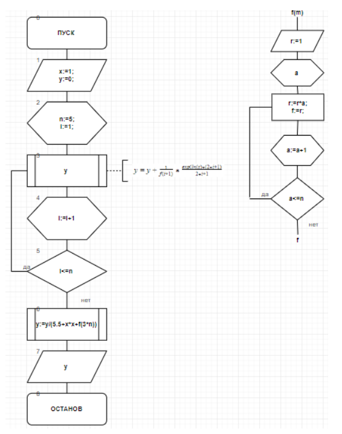
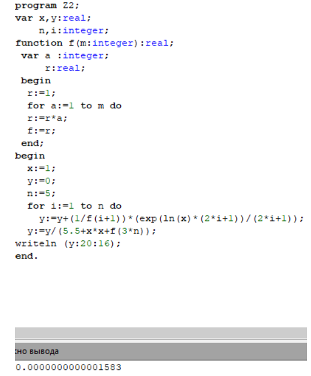

.. title: Лабораторная работа №4: "ДЦВП с управлением по аргументу. Численное интегрирование"
.. slug: lab-4
.. date: 2019-11-10
.. tags: computer-science, lab, 1st-grade
.. author: Eugene Savostin
.. link: https://docs.google.com/document/d/1dE34TU41EzskqYZC1O7IB1NTSv9pDEDJtSpnSE78efU/edit?usp=sharing
.. description: 
.. category: lab-work

:Тема: Детерминированные циклические вычислительные процессы с управлением по аргументу. Численное интегрирование
:Цель: Научиться организации ДЦВП с управлением по аргументу на примере численного интегрирования
:Используемое оборудование: ПК, среда программирования PascalABC

===========
Задание 1.1
===========
**Постановка задачи:** 

Решить задачу методом трапеций

:Блок-схема: 

.. image:: ../../images/4.1.1.png 

:Код программы:

.. listing:: 4.1.1.pas pascal

:Результат работы:

.. image:: ../../images/4.1.1_res.png

**Анализ полученных результатов:** 

В ходе выполнения работы мной был использован оператор “function”, который облегчил 
последующую запись кода. В решении был использован метод трапеций, как и оговаривалось в формулировке задания.

===========
Задание 1.2
===========
**Постановка задачи:** 

Решить задачу методом парабол

:Блок-схема: 

.. image:: ../../images/4.1.2.png 

:Код программы:

.. listing:: 4.1.2.pas pascal

:Результат работы:

.. image:: ../../images/4.1.2_res.png

**Анализ полученных результатов:** 

В ходе решения задачи я применял оператор “function” для облегчения записи кода. 
В конечном итоге в ответе программа выводит значение, близкое к значениям из ЛР 3.

=========
Задание 2
=========
**Постановка задачи:** 

Решить задачу методом парабол

:Блок-схема: 

:Код программы:

.. listing:: 4.2.pas pascal

:Результат работы:

**Анализ полученных результатов:** 

В ходе выполнения работы я также использовал function, как и в предыдущих заданиях. 
Введение функции было нужно, чтобы рассчитать значение факториалов.

**Вывод**

Использование оператора “function” значительно ускоряет процесс написания кода, потому что необходимость 
каждый раз прописывать одно и то же действие для каждого значения отпадает. Программа просто каждый раз 
обращается к заранее заданной функции.