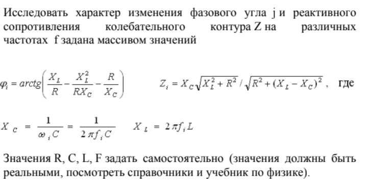
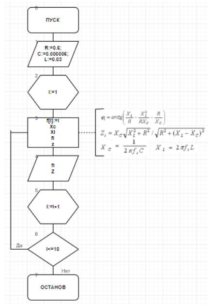
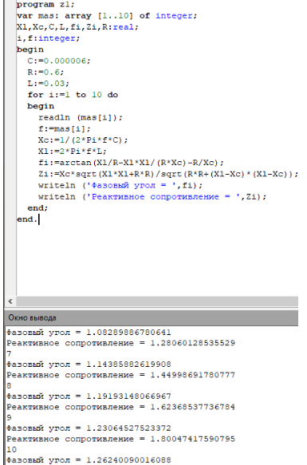
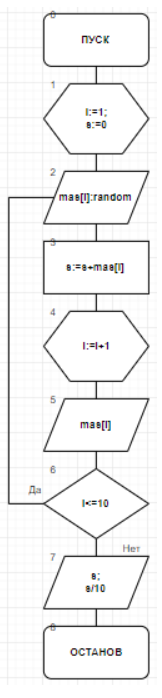
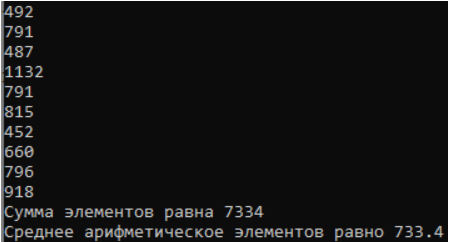
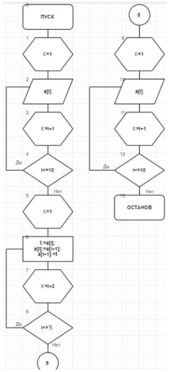
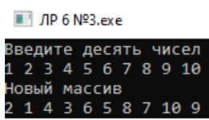
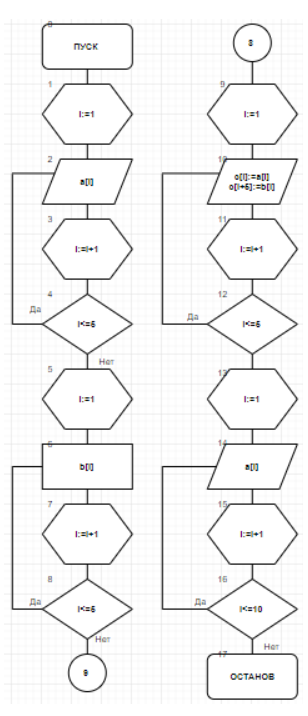

.. title: Лабораторная работа №6 "Детерминированные циклические вычислительные процессы с управлением по индексу"
.. slug: lab-6
.. date: 2019-11-26
.. tags: computer-science, lab, 1st-grade
.. author: Eugene Savostin
.. link: https://docs.google.com/document/d/19vacwGTLfs1dwH-Yl8bSjyxZxFDO15w6h1L_ib2SGc8/edit?usp=sharing
.. description: 
.. category: lab-work

:Тема: Детерминированные циклические вычислительные процессы с управлением по аргументу
:Цель: Научиться вычислять детерминированные циклические вычислительные процессы с управлением по аргументу
:Используемое оборудование: ПК, среда программирования PascalABC

=========
Задание 1
=========
**Постановка задачи:** 

:Блок-схема: 

:Код программы:

.. listing:: 6.1.pas pascal

:Результат работы:

**Анализ полученных результатов:** 

С использованием массива я исследовал характер изменения реактивного сопротивления при различных значениях частоты.

=========
Задание 2
=========
**Постановка задачи:** 

Одномерный массив задан случайным образом. Организовать вывод массива. 
Найти сумму его элементов, вычислить среднее арифметическое его элементов.

:Блок-схема: 

:Код программы:

.. listing:: 6.2.pas pascal

:Результат работы:

**Анализ полученных результатов:** 

С помощью оператора “random” я присвоил элементам массива случайные значения в диапазоне от 0 до 1233.

=========
Задание 3
=========
**Постановка задачи:** 

Одномерный массив вводится пользователем с клавиатуры. Переставить элементы массива, стоящие на четных и нечетных местах. 
Задачу решить без проверки на четность индексов массива.

:Блок-схема: 

:Код программы:

.. listing:: 6.3.pas pascal

:Результат работы:

**Анализ полученных результатов:** 

В ходе выполнения задания я ввел промежуточную переменную, чтобы поменять местами элементы массива.

=========
Задание 4
=========
**Постановка задачи:** 

Заданы массивы А(5) и В(5). Получить массив С(10), расположив в начале его элементы массива А, а затем - элементы массива В. 
Для формирования массива С использовать один цикл.

:Блок-схема: 

:Код программы:

.. listing:: 6.4.pas pascal

:Результат работы:

.. image:: ../../images/6.4_res.png

**Анализ полученных результатов:** 

Был использован цикл для ввода массивов А и В, а также для нахождения и вывода массива С.

**Вывод**

В ходе проделанной работы были организованы детерминированные ЦВП с использованием массивов.