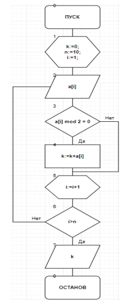
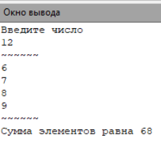
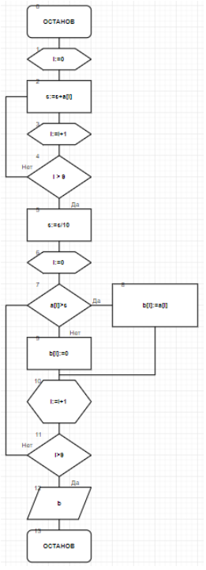

.. title: Лабораторная работа №10 "Вариационный ряд"
.. slug: lab-10
.. date: 2019-12-15
.. tags: computer-science, lab, 1st-grade
.. author: Eugene Savostin
.. link: https://docs.google.com/document/d/1QQ4pXvxCLWtIAnOvxoLuvEW6yMP8y1ZlFYFOWu5zucE/edit?usp=sharing
.. description: 
.. category: lab-work

:Тема: Вариационный ряд
:Цель: Научиться организовывать вычисления при помощи вариационного ряда
:Используемое оборудование: ПК, среда программирования PascalABC

=========
Задание 1
=========
**Постановка задачи:** 

Дан одномерный массив. Найти сумму четных по значению элементов массива.

:Блок-схема: 

:Код программы:

.. listing:: 10.1.pas pascal

:Результат работы:

**Анализ полученных результатов:** 

При выполнении программы мной были использованы операторы “for” и “if..then” для достижения выполнения задачи.

=========
Задание 2
=========
**Постановка задачи:** 

Дан одномерный массив. С клавиатуры вводится число. Найти сумму всех элементов массива, значения которых больше числа, введеного с клавиатуры и вывести их индексы.

:Блок-схема: 

.. image:: ../../images/10.2.png 

:Код программы:

.. listing:: 10.2.pas pascal

:Результат работы:

**Анализ полученных результатов:** 

При выполнении задания мной были использованы операторы “for” и “if..then”,а также накопительная переменная k.

=========
Задание 3
=========
**Постановка задачи:** 

Дан одномерный массив. Найти его среднее арифметическое. Составить второй массив элементами
которого будут элементы первого массива, которые больше среднего арифметического. Остальные элементы заменить нулями.

:Блок-схема: 

:Код программы:

.. listing:: 10.3.pas pascal

:Результат работы:

.. image:: ../../images/10.3_res.png

**Анализ полученных результатов:** 

При выполнении программы мной были использованы операторы “for” и “if..then” для достижения выполнения задачи.