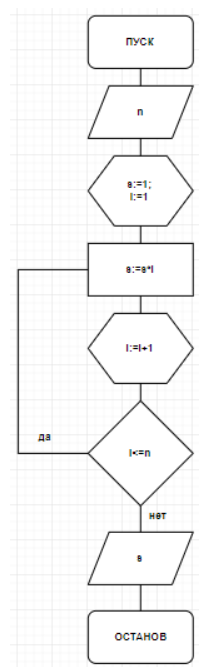
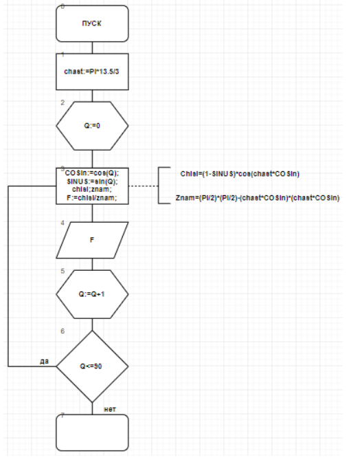
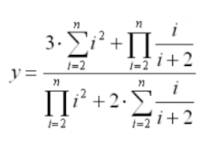

.. title: Лабораторная работа №2 "Детерминированные циклические вычислительные процессы с управлением по аргументу"
.. slug: lab-2
.. date: 2019-10-17
.. tags: computer-science, lab, 1st-grade
.. author: Eugene Savostin
.. link: https://docs.google.com/document/d/1ktakAc_z-5QbbkvwbftQwp1ry9PDix4wtyWlMKYjYIo/edit?usp=sharing
.. description: 
.. category: lab-work

:Тема: Детерминированные циклические вычислительные процессы с управлением по аргументу
:Цель: Научиться вычислять детерминированные циклические вычислительные процессы с управлением по аргументу
:Используемое оборудование: ПК, среда программирования PascalABC

=========
Задание 1
=========
**Постановка задачи:** 

Вычислить n!, где n вводится с клавиатуры.

:Блок-схема: 

:Код программы:

.. listing:: 2.1.pas pascal

:Результат работы:

.. image:: ../../images/2.1_res.png

**Анализ полученных результатов:** 

К переменной результата был применен тип longint, так как тип integer 
в данном случае не подходит, ведь при его помощи невозможно рассчитывать факториалы больших чисел.

=========
Задание 2
=========
**Постановка задачи:** 

Рассчитать значения для построения диаграммы направленности антенны в вертикальной плоскости.

.. image:: ../../images/2.2_q.png 

:Блок-схема: 

:Код программы:

.. listing:: 2.2.pas pascal

:Результат работы:

.. image:: ../../images/2.2_res.png

**Анализ полученных результатов:** 

Выполняя данную работу, разбил основное выражение на несколько маленьких, после чего вычислил ответ. 
Организовал цикл и вывод результата после прохождения каждого нового значения через него.

=====================
Задание 3 (Вариант 9)
=====================
**Постановка задачи:** 

Вычислить y при исходных n=25, x= -2.1 по формуле:

.. image:: ../../images/2.3_q.png 

:Блок-схема: 

.. image:: ../../images/2.3.png 

:Код программы:

.. listing:: 2.3.pas pascal

:Результат работы:

.. image:: ../../images/2.3_res.png

**Анализ полученных результатов:** 

При выполнении задания совершил предварительные вычисления в цикле, а финальное - единожды. 
Также использовал при возведении в степень формулу с экспонентой и натуральным логарифмом для 
уменьшения времени работы программы.

==========
Задание 4
==========
**Постановка задачи:** 

:Блок-схема: 

.. image:: ../../images/2.4.png 

:Код программы:

.. listing:: 2.4.pas pascal

:Результат работы:

.. image:: ../../images/2.4_res.png

**Анализ полученных результатов:** 

При выполнении задания разбил большое выражение на более малые для ускорения работы программы. 
Все предварительные вычисления производил в цикле, а финальное - единожды.

**Вывод:**

В ходе проделанной работы освоил способ реализации детерминированного циклического вычислительного процесса с управлением по аргументу.
