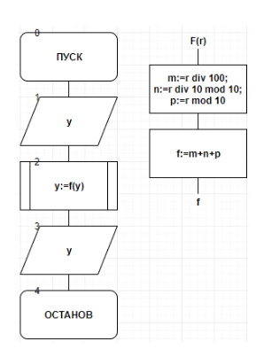
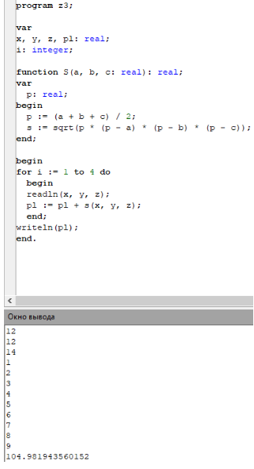
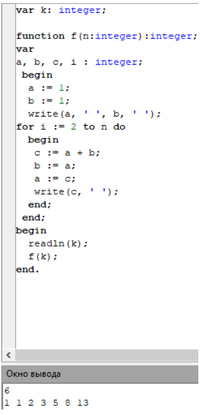

.. title: Лабораторная работа №5 "Процедуры и функции". Вариант 9
.. slug: lab-5
.. date: 2019-11-14
.. tags: computer-science, lab, 1st-grade
.. author: Eugene Savostin
.. link: https://docs.google.com/document/d/1VAjkJXxrGmpVoOq1l-EXS5ypydLf4i05VUQgSsQGfMQ/edit?usp=sharing
.. description: 
.. category: lab-work

:Тема: Процедуры и функции
:Цель: Научиться организации вычислительного процесса с участием процедур и функций
:Используемое оборудование: ПК, среда программирования PascalABC

=========
Задание 1
=========
**Постановка задачи:** 

Перевести дюймы в сантиметры от 0 до 100 дюймов. Результаты вывести в виде таблицы. операторы для 
формирования вывода таблицы оформить в виде пользовательской процедуры.

:Блок-схема: 

.. image:: ../../images/5.1.png 

:Код программы:

.. listing:: 5.1.pas pascal

:Результат работы:

.. image:: ../../images/5.1_res.png

**Анализ полученных результатов:** 

Выполняя данную работу, я использовал оператор “procedure”, чтобы организовать более быстрое вычисление данных.

=========
Задание 2
=========
**Постановка задачи:** 

Найти сумму цифр введенного с клавиатуры целого трехзначного числа. Для подсчета суммы использовать функцию.

:Блок-схема: 

:Код программы:

.. listing:: 5.2.pas pascal

:Результат работы:

.. image:: ../../images/5.2_res.png

**Анализ полученных результатов:** 

Выполняя данную работу, я использовал оператор “function”, чтобы один раз написать в коде 
искомую функцию, просто позже просто ее подставлять, а не вписывать каждый раз. Тем самым 
работа по вычислению ответа была ускорена.

=========
Задание 3
=========
**Постановка задачи:** 

Вычислить площадь фигуры, заданной сторонами. Фигура не является прямоугольником, а треугольники, 
из которых состоит фигура, не являются прямоугольными.

:Блок-схема: 

.. image:: ../../images/5.3.png 

:Код программы:

.. listing:: 5.3.pas pascal

:Результат работы:

**Анализ полученных результатов:** 

Выполняя данную работу, я вводил функцию и цикл для того, чтобы укоротить код программы и сократить время ее выполнения.

=========
Задание 4
=========
**Постановка задачи:** 

С клавиатуры вводится число. Вывести на экран столько элементов
ряда Фибоначчи, сколько указал пользователь. Вычисление ряда
организовать в функцию. Например, если на ввод поступило число
6, то вывод должен содержать шесть первых чисел ряда Фибоначчи:
1 2 3 5 8 13.

:Блок-схема: 

.. image:: ../../images/5.4.png 

:Код программы:

.. listing:: 5.4.pas pascal

:Результат работы:

**Анализ полученных результатов:** 

Были введены промежуточные переменные, вычисления k-ого члена производились с помощью функции.

**Вывод**

В ходе проделанной лабораторной работы мы научились организовывать ВП с использованием функций и процедур.