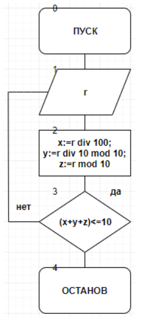
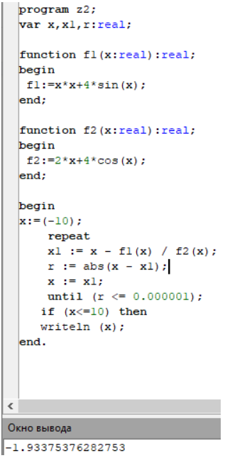

.. title: Лабораторная работа №7 "Итерационные циклические вычислительные процессы с управлением по функции"
.. slug: lab-7
.. date: 2019-11-28
.. tags: computer-science, lab, 1st-grade
.. author: Eugene Savostin
.. link: https://docs.google.com/document/d/1hrQnBRvp6JC3Wi6FZghtKZBKhLBS1VRnliRtPwM6oEM/edit?usp=sharing
.. description: 
.. category: lab-work

:Тема: Итерационные циклические вычислительные процессы с управлением по функции
:Цель: Научиться организовывать итерационные циклические вычислительные процессы с управлением по функции
:Используемое оборудование: ПК, среда программирования PascalABC

=========
Задание 1
=========
**Постановка задачи:** 

С клавиатуры вводится трехзначное число, считается сумма его цифр. Если суммма цифр числа больше 10, то вводится следующее трехзначное
число, если меньше 10 - программа завершается.

:Блок-схема: 

:Код программы:

.. listing:: 7.1.pas pascal

:Результат работы:

.. image:: ../../images/7.1_res.png

**Анализ полученных результатов:** 

С помощью данной программы получена сумма цифр трехзначного числа, которая меньше либо равна 10. На выход полученные данные типа integer.

=========
Задание 2
=========
**Постановка задачи:** 

.. image:: ../../images/7.2_q.png 

:Блок-схема: 

.. image:: ../../images/7.2.png 

:Код программы:

.. listing:: 7.2.pas pascal

:Результат работы:

**Анализ полученных результатов:** 

С помощью данной программы было решено нелинейное уравнение методом Ньютона. На выход получены данные типа real.

**Вывод**

В ходе данной лабораторной работы были организованы итерационные циклические вычислительные процессы с управлением по функции.