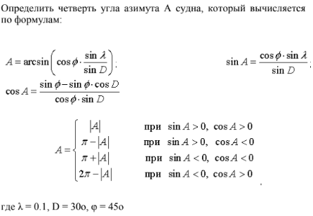
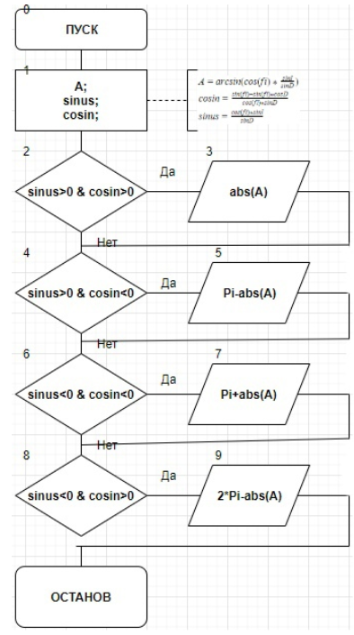
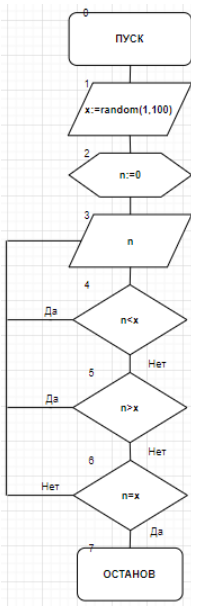
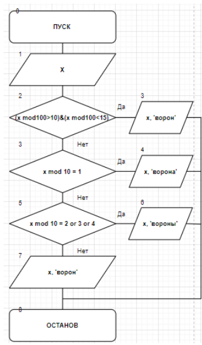
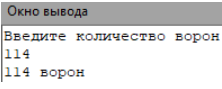

.. title: Лабораторная работа №9 "Разветвляющиеся вычислительные процессы. Оператор выбора"
.. slug: lab-9
.. date: 2019-12-10
.. tags: computer-science, lab, 1st-grade
.. author: Eugene Savostin
.. link: https://docs.google.com/document/d/1UXOSCGqohTkmrVx_6lN1qx74rcSXIgK9DhcUelOfU-Y/edit?usp=sharing
.. description: 
.. category: lab-work

:Тема: Разветвляющиеся вычислительные процессы. Оператор выбора
:Цель: Научиться организовывать разветвляющиеся вычислительные процессы и пользоваться оператором выбора
:Используемое оборудование: ПК, среда программирования PascalABC

=========
Задание 1
=========
**Постановка задачи:** 

Программа считывает с клавиатуры пятизначное число и определяет, является ли оно палиндромом.

:Блок-схема: 

.. image:: ../../images/9.1.png 

:Код программы:

.. listing:: 9.1.pas pascal

:Результат работы:

.. image:: ../../images/9.1_res.png

**Анализ полученных результатов:** 

В данной работе я использовал связку операторов выбора “if/else”, чтобы добиться от программы анализа числа и сравнения его с палиндромами.

=========
Задание 2
=========
**Постановка задачи:** 

:Блок-схема: 

:Код программы:

.. listing:: 9.2.pas pascal

:Результат работы:

.. image:: ../../images/9.2_res.png

**Анализ полученных результатов:** 

При выполнении данной работы я обращался к оператору выбора “if”, чтобы организовать выполнение программой анализа полученных из вычислений данных.

=========
Задание 3
=========
**Постановка задачи:** 

"Угадай число". Составить программу, которая бы случайным образом загадывала число от 1 до 100, и предлагала Вам его угадать.
При неправильном ответе, программа должна выводить сообщение о том, больше загаданное число или меньше. В случае победы выводится поздравление.
Программа дает возможность вводить число до тех пор, пока пользователь не угадает. 

:Блок-схема: 

:Код программы:

.. listing:: 9.3.pas pascal

:Результат работы:

.. image:: ../../images/9.3_res.png

**Анализ полученных результатов:** 

При выполнении работы, я использовал оператор “random”, чтобы программа задавала случайное число; “repeat..until” для 
создания цикла угадывания. Все элементы типа “integer”, чтобы программа не могла задать дробное число.

=========
Задание 4
=========
**Постановка задачи:** 

Сформировать вывод слова "ворона" в зависимости от любого числительного, которое вводится с клавиатуры. Например, 1 - ворона, 3 - вороны, 5 - ворон

:Блок-схема: 

:Код программы:

.. listing:: 9.4.pas pascal

:Результат работы:

**Анализ полученных результатов:** 

Выполняя данную работу, я использовал операторы “if..else” и “case”, чтобы добавить вариативности выводам, 
которыми программа может оперировать после анализа вводимых данных.

**Вывод:**

Операторы выбора значительно добавляют вариативности выводов программе и при этом достаточно несложные для освоения.
